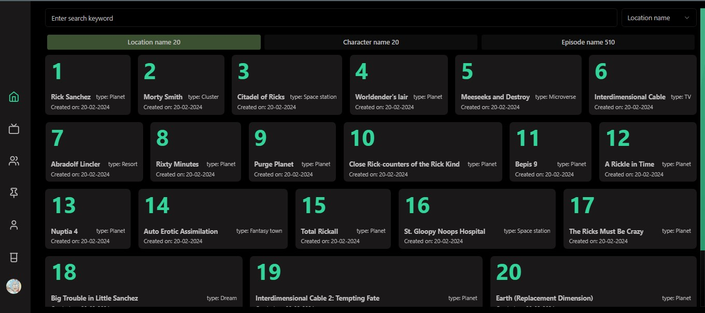
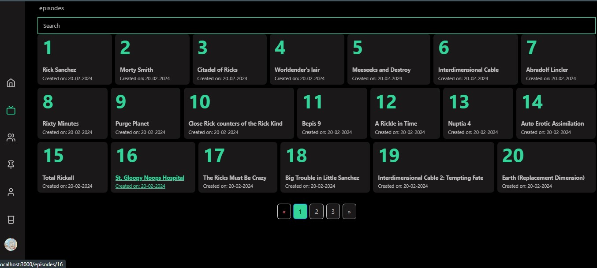
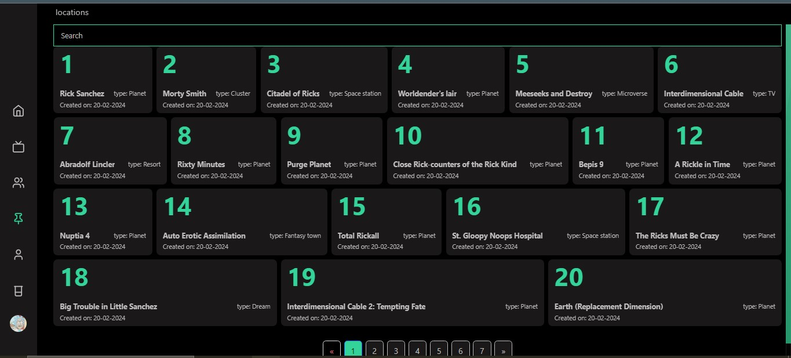
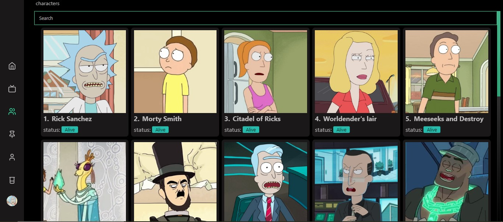
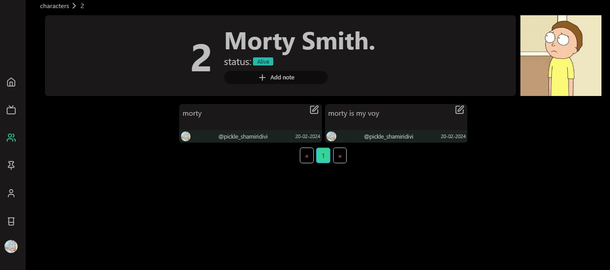

# Shamiri Rick & Morty API Challenge

## Time spent
  - opened email on 14/02/2024 8 PM
  - started on 15/02/2024 Thursday
  - finished on 20/02/2024 Tuesday
  - 4 business days  [37 hours  24 mins Wakatime stats](https://wakatime.com/@018cc20e-ad5a-4d40-ad76-7d398731446f/projects/kfmptouvxp?start=2024-02-14&end=2024-02-20)
  

## Features:
- Search through  for Rick and Morty AOI, locations , episodes and characters all in one view with tabs synchronized with URL search parameters
- View the episodes , locations and characters of Rick and Morty with a search bar and filtering options.
- View character details and notes.
- add notes to characters.
- view other people's notes
- sharing URL's will maintain activity state  using search parameters
- Authentication with Email-Password , password reset and email verification + google and github OAuth sign-in.
  responsive design with light and dark mode powered by `TailwindCSS` and `DaisyUI` , new themes can be added with a single line addition to `tailwind.config.js`


## Tech stack

- [RakkasJS](https://rakkasjs.org/) : React + Vite SSR framework
  
  why:
  - My laptop isn't that powerful and Nextjs can get intense
  - Rakkasjs (server-only/client-only/common) middleware and hooks that let me setup server only and client only parts of the application much easier
    for example initializing React-Relay ,doing the fetching server side during SSR and populating the client cache on the client side


```tsx
    // entry-hattip (server side)
    function createRelayEnvironment(ctx: RequestContext) {
   return new Environment({
    network: Network.create((request, variables, cacheConfig, uploadables) =>
      fetchFn({
        fetchVars: { request, variables, cacheConfig, uploadables },
        token:undefined,
      }),
    ),
    store: new Store(new RecordSource()),
    isServer: true,
  });
}

  createPageHooks(requestContext) {
    const serverRelayEnvironment = createRelayEnvironment(requestContext);
    return {
      emitToDocumentHead() {
        const cookie_theme = requestContext?.cookie?.theme;
        const relay_data = serverRelayEnvironment
          ?.getStore()
          ?.getSource()
          ?.toJSON();
        return `
    <link rel="icon" type="image/svg+xml" href="/site.svg" />
    <script>
      (function() {
        document.documentElement.setAttribute("data-theme", "${cookie_theme}");
      })();
     </script>
     <script>__RELAY_DATA__=${JSON.stringify(relay_data)}</script>

  `;
      },

      wrapApp(app) {
        return (
          <RelayEnvironmentProvider environment={serverRelayEnvironment}>
            {app}
          </RelayEnvironmentProvider>
        );
      },

      }

      }
```

```tsx
// entry-client (client side)
const relay_data_from_server = (window as any)?.__RELAY_DATA__;

function createRelayEnvironment() {
  return new Environment({
    network: Network.create((request, variables, cacheConfig, uploadables) =>
      fetchFn({
        fetchVars: { request, variables, cacheConfig, uploadables },
        token: undefined,
      }),
    ),
    store: new Store(RecordSource.create(relay_data_from_server)),
    isServer: false,
  });
}
export const clientRelayEnvironment = createRelayEnvironment();

startClient({
  hooks: {
    beforeStart() {
      // Do something before starting the client
    },

    wrapApp(app) {
      return (
        <RelayEnvironmentProvider environment={clientRelayEnvironment}>
          {app}
        </RelayEnvironmentProvider>
      );
    },
  },
});
```

- RakkasJS uses [Hattip](https://github.com/hattipjs/hattip) for it's server side stuff , which allows it to be hosted everywhere [Hattip](https://github.com/hattipjs/hattip) can , they have adapters for
  - Nodejs
  - Deno
  - bun
  - AWS lambda
  - Vercel
  - Netlify


- I'll be using the `GraphQL` endpoint for the API , because of it's scalable and type safe nature with solid contracts between the backend and frontend and it's ability to avoid waterfalls using clients like [React-Relay](https://relay.dev/) 
  you can also get all the locations , characters , episodes in one query
  
```graphql
  export const searchLocationsQuery = graphql`
  query SearchListLocationsQuery($name: String!, $page: Int) {
    # start of query
    #  start of locations query
    locations(page: $page, filter: { name: $name }) {
      info {
        count
        next
        pages
        prev
      }
      results {
        id
        name
        type
 
      }
    }
    #  end of locations query

    # start of characters query
    characters(page: $page, filter: { name: $name }) {
      info {
        count
        next
        pages
        prev
      }
      results {
        id
        name
        location {
          id
          name
          type

        }
      }
    }
    # end of characters query

    # start of episodes query

    episodes(page: $page, filter: { name: $name }) {
      info {
        count
        next
        pages
        prev
      }
      results {
        id
        name
        created
        air_date
        characters {
          location {
            id
            name
            type
          }
        }
      }
    }
    # end of episodes query

    #  end of query
  }
`;
  ```
  
  
### State management and data fetching
- [React-Relay](https://relay.dev/) allows us to break the query down into a fragment per data fetching component and uses it's compiler to auto generates the types and create one optimized query that avoids client-server round trips in cases of nested components doing their independent data fetching .
I also picked this because I've been brushing up on it and having lots of fun with it [small writeup](https://dev.to/tigawanna/react-relay-2-years-later-its-still-awesome-jdg) 

- Built in RakkasJS hooks (useQuery/Mutation,UseServerSideQuery/Mutation) which are inspired by the tanstack query API and integrated to work well with SSR


### Styling
- Tailwind for styling + shadcn for components 

### Database
- [Pocketbase](https://pocketbase.io/): The challenge seems to require some trivial database activity and going full postgres + drizzle feels overkill , Pocketbase gives me a database ,  authentication and user management a client SDK and an admin dashboard
  

## File structure

### Directory structure

RakkasJS uses a file based router just like Nextjs files in 
`src/pages` that matches `*.page.tsx` and exports a default component will be treated as a page

- [/ route](src/pages/index.page.tsx) : will be the root page for route `/`
  The search bar will be displayed and some default location results
  will be shown , typing into the search bar will filter the results and selecting `character` or `episode` will display the  location results for those in their respective tabs ( clicking on the tabs will have the same effect as using the select box)


- [/episode route](src/pages/episode/index.page.tsx) : will display episode results and will also have [/episode/id route](src/pages/episode/[episode]/index.page.tsx) for each episode
  

- [/location route](src/pages/location/index.page.tsx) : will display location results and will also have [/location/id route](src/pages/location/[location]/index.page.tsx) for each location


- [/character route](src/pages/character/index.page.tsx) : will display characters results and will also have  [/characters/id route](src/pages/characters/[character]/index.page.tsx) for each character , The Characters tab also has a section to add a note about the character
- 





There's also bonus profile and auth routes to manage the users who will comment as the users can leave note but also see notes left by other users , one can also edit their notes 

## Challenges

### 1. The GraphQL API
The GraphQL API was the most efficient way to accomplish the task as it minimizes the number of requests we have to make , `client-server` waterfalls waterfalls are can be one of the biggest performance issues in your average site , Dan Abramov had some claims on how react server components avoid this and a lively debate ensued on the topic , Ryan Carniato (SolidJS creator) dedicated his 
 [Friday stream](https://www.youtube.com/watch?v=hiYQC4XaUu4) to discuss the topic.

 One thing that kept coming up was that the GraphQL with Relay was peak frontend data fetching with it's ability to delegate fragments to components and compose them into a single optimized query with it's compiler.

 The issue was that the Rick and Morty GraphQL isn't relay friendly and causes relay to complain a lot
The main issues with it were
    
- lack of fragments : everything is just a scalar making us clever caching react relay does
- Lack of nested pagination :
  
```graphql
    episodes(page: $page, filter: { name: $name }) {
      info {
        count
        next
        pages
        prev
      }
      results {
        id
        name
        created
        air_date
        characters {
          location {
            id
            name
            type
          }
        }
      }
    }

```

Because of the lack of fragments and relay friendly architecture retuning `edges` for paginatable data and `nodes` for non paginatable data it make it hard to deal with queries that return nested results for example 

```graphql
    locations(page: $page, filter: { name: $name }) {
      info {
        count
        next
        pages
        prev
      }
      results {
        id
        name
        type
 
      }
    }
    #  end of locations query

    # start of characters query
    characters(page: $page, filter: { name: $name }) {
      info {
        count
        next
        pages
        prev
      }
      results {
        id
        name
        location {
          id
          name
          type

        }
      }
    }
    # end of characters query

    # start of episodes query

    episodes(page: $page, filter: { name: $name }) {
      info {
        count
        next
        pages
        prev
      }
      results {
        id
        name
        created
        air_date
        characters {
          location {
            id
            name
            type
          }
        }
      }
    }
``` 
This is the query that I used to achieve this objective
> Retrieve a list of locations (name and type), along with the residents of that location and their status.
Implement the ability to search or filter location results by location name, character name or episode name.
Display the data in a manner that allows you to view the location, its residents and see an image of the resident with a representation of their name & status.

it works but we'll have to unwrap 3 layers of nested data in the last one , 2 for the prior and the nested data is possibly unlimited since only the top level results are returned in pages form (am assuming) this wouldn't be staring forward to implement without returning cursors  for the next page .

so when consuming it in the frontend we need to use virtual lists with [Virtuoso](https://virtuoso.dev/) because we're not sure how big a response we'll get , the biggest I got was ( 500 episodes , which isn't that big but we have no guarantees on that , it could be bigger)  

```tsx
const episode_locations = React.useMemo(() => {
    return (
      episodes?.results
        ?.flatMap((e) => e?.characters)
        .flatMap((c) => c?.location) ?? []
    );
  }, [episodes]);

  return (
        <VirtuosoGrid
          style={{ height: "80vh", width: "100%" }}
          totalCount={episode_locations?.length}
          data={episode_locations}
          // @ts-expect-error
          components={gridComponents}
          itemContent={(index, one_episode) => {
            if (!one_episode) return null;
            const key = `${one_episode?.id}${one_episode?.name}`;
            return (
              <ItemWrapper>
                <OneItemCard
                  href={`/locations/${one_episode?.id}`}
                  key={key}
                  id={one_episode?.id}
                  name={one_episode?.name}
                  type={one_episode?.type}
                />
              </ItemWrapper>
            );
          }}
        />
  )
```

### 2 The phrasing of the requirement
 
 > Display the data in a manner that allows you to view the location, its residents and see an image of the resident with a representation of their name & status.
 
 This part had me trying to fit the residents as a nested list under the locations list.

I spent the first day of trying out approaches to see how many perfomance and UX challenges this would present and am glad that after reaching out to the team they determined that rendering the location results as links to the characters would be an acceptable solution and I went with  that as I did not have to worry about the virtualized nested data with images  

### 3. React relay and suspense
Relay is built around suspense data fetching , it doesn't have an `isLoading` or `isError` field from it's data fetching hooks `uselazyLoadQuery` and `useLFragment` so they need to be wrapped with a `<Suspense/>` component.

Having a search bar inside a suspense boundary would cause a lot of flickering while the data is loading.

To remedy this I tried hoisting out the search component and state into the parent component and passing down the current keyword into the data fetching component  

```tsx
export function SearchComponentParet() {
  const [keyword, setKeyword] = React.useState("");
  return (
      <div className="w-full">
      <input onChange={(e) => setKeyword(e.target.value)} value={keyword}/>
      <Suspense>
        <DataFetchingComponent keyword={keyword}/>
      </Suspense>
      </div>
  )

}
```

Even though the suspense boundary isn't covering our search bar ,the suspense boundary will still keep showing after every value change (even with debouncing) ,
Lucky for us React 18 came with some more stuff along `Suspense` that help in concurrent rendering in particular I used the `useTransition` hook that allows us to mark the input changes as more urgent hence forcing all other renders to the background , including the suspending component


```tsx
export function SearchComponentParet() {
  const [keyword, setKeyword] = React.useState("");
  const [isPending, startTransition] = useTransition();
  return (
      <div className="w-full">
      <input onChange={(e) => startTransition(setKeyword(e.target.value))} value={keyword}/>
      <Suspense>
        <DataFetchingComponent keyword={keyword}/>
      </Suspense>
      </div>
  )

}
```

This way , we'll maintain the view of the old results as the new ones are fetched in between typing giving us better UX overall

### Possible improvements:

1. Add unit and end to end tests : Right now am mostly relying on Typescript `tsc` to check for broken typescript code and types but that doesn't cover logical bugs .
2. Add liking and commenting on people's notes : Pocketbase can definitely achieve this because even if the SDK has limits , it allows you to write raw `SQl`  
3. Add some sort of polling mechanism for people to rate their favorite characters :

