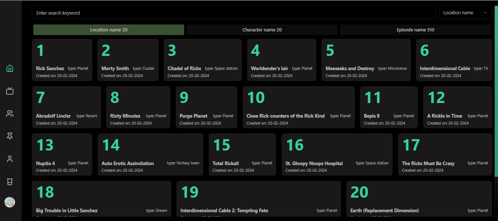
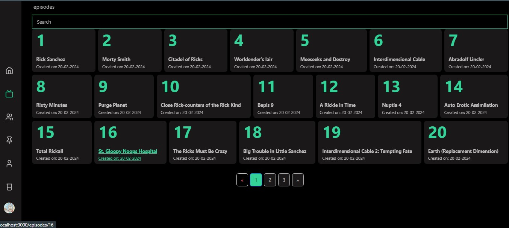
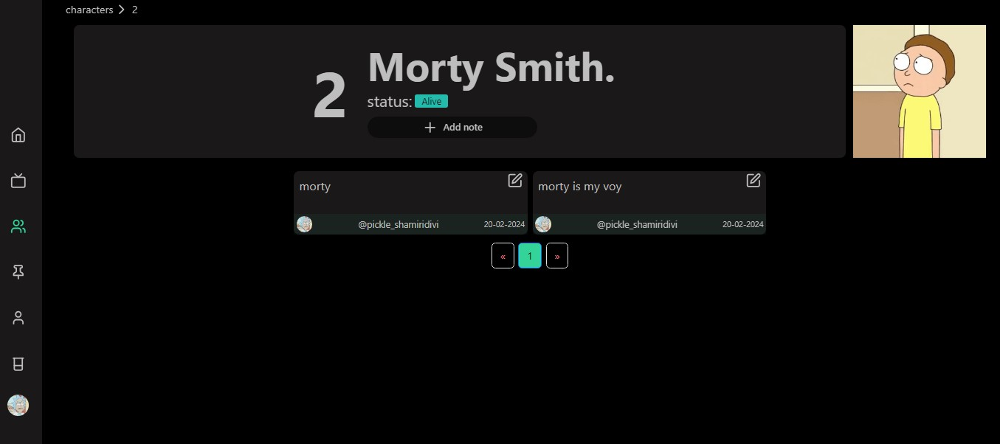

# File structure

## Directory structure

RakkasJS uses a file based router just like Nextjs files in 
`src/pages` that matches `*.page.tsx` and exports a default component will be treated as a page

- [/ route](src/pages/index.page.tsx) : will be the root page for route `/`
  The search bar will be displayed and some default location results
  will be shown , typing into the search bar will filter the results and selecting `character` or `episode` will display the  location results for those in their respective tabs ( clicking on the tabs will have the same effect as using the select box)

- [/episode route](src/pages/episode/index.page.tsx) : will display episode results and will also have [/episode/id route](src/pages/episode/[episode]/index.page.tsx) for each episode
  

- [/location route](src/pages/location/index.page.tsx) : will display location results and will also have [/location/id route](src/pages/location/[location]/index.page.tsx) for each location

- [/character route](src/pages/character/index.page.tsx) : will display characters results and will also have  [/characters/id route](src/pages/characters/[character]/index.page.tsx) for each character , The Characters tab also has a section to add a note about the character
- 

There's also bonus profile and auth routes to manage the users who will comment as the users can leave note but also see notes left by other users , one can also edit their notes 
